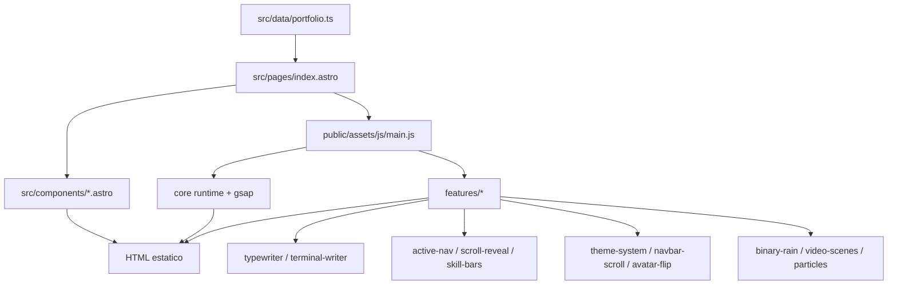
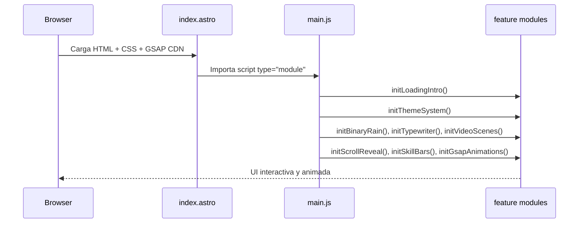
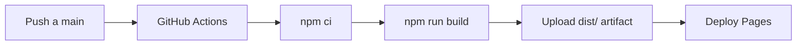

# Portfolio Futurista - Astro + Vanilla JS

Sitio web personal tipo portfolio con estilo terminal/cyberpunk, construido como **sitio estatico** con Astro y modulos JS vanilla para interacciones visuales.

## Que es esta app

Esta app es el portfolio de Daniel Bautista. Presenta informacion profesional en secciones (about, carrera, estudios, skills, proyectos, hobbies y contacto), con una experiencia visual inmersiva:

- fondo con escenas de video
- efecto binary rain en canvas
- barra de navegacion activa por seccion
- animaciones progresivas y reveal al hacer scroll
- selector de temas visuales
- efecto typewriter y terminal writer

El contenido vive en `src/data/portfolio.ts` y la pagina principal se arma en `src/pages/index.astro` con componentes Astro reutilizables.

## Tecnologias

- **Astro 6** (render estatico)
- **TypeScript** (data modules)
- **JavaScript ESM vanilla** (features del frontend)
- **CSS custom** (`public/assets/css/style.css`)
- **GSAP + ScrollTrigger (CDN)** para animaciones
- **GitHub Actions + GitHub Pages** para CI/CD y despliegue
- **Node.js 20** en pipeline de deploy

Dependencias del proyecto:

- `astro`
- `@google/stitch-sdk`
- `@modelcontextprotocol/sdk`

> Nota: el sitio portfolio funciona sin backend. El script `stitch-mcp-server.mjs` es una utilidad separada para correr un servidor MCP local con Stitch cuando se necesita.

## Arquitectura



### Flujo de inicializacion frontend



## Estructura del proyecto

```text
.
|- src/
|  |- pages/index.astro
|  |- components/*.astro
|  `- data/portfolio.ts
|- public/
|  |- assets/js/core/*.js
|  |- assets/js/features/*.js
|  |- assets/css/style.css
|  |- assets/images/*
|  `- assets/video/*
`- .github/workflows/deploy.yml
```

## Scripts

Desde la raiz del proyecto:

```bash
npm install
npm run dev
npm run build
npm run preview
```

- `npm run dev`: entorno local de desarrollo
- `npm run build`: genera `dist/`
- `npm run preview`: sirve el build de produccion localmente

## Deploy

El deploy es automatico a GitHub Pages al hacer push a `main`.



Workflow: `.github/workflows/deploy.yml`.

## MCP Stitch (opcional)

Si quieres correr el servidor MCP local incluido:

1. Define `STITCH_API_KEY`.
2. Ejecuta:

```bash
node stitch-mcp-server.mjs
```

Si no existe `STITCH_API_KEY`, el proceso termina con error por seguridad.

## Estado actual de calidad

- No hay script de lint configurado.
- No hay framework de tests configurado.
- Validacion recomendada actual: `npm run build`.

---

Si quieres, puedo dejarte una version alternativa de este README orientada a reclutadores (mas narrativa) o una version mas tecnica para contribuidores.
